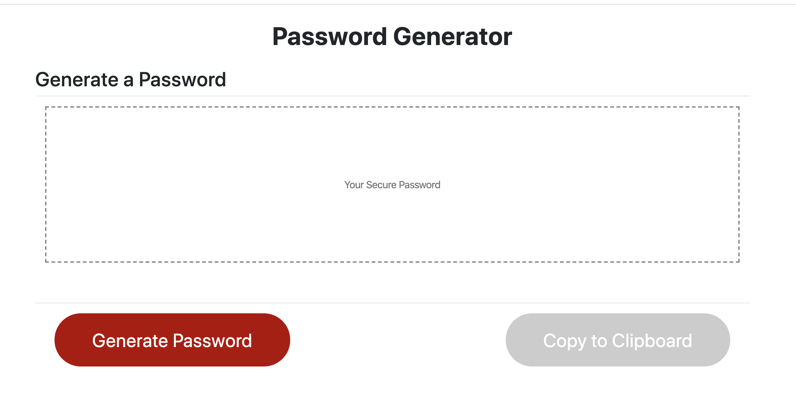

# hw-12-18
# Password Generator

## Description 

Users will be prompted to choose from the following password criteria:

* Length (must be between 8 and 128 characters)

* Character type:

  * Special characters ([see examples](https://www.owasp.org/index.php/Password_special_characters))

  * Numeric characters

  * Lowercase characters

  * Uppercase characters

Users should input and ensure that at least one character type is selected.
Users should also have the option to click a button to copy the password to their clipboard.

## Installation

Clone this repo

git clone https://github.com/rnyang-16/hw-12-18

and open index.html in your favorite browser.

## Usage 

Open index.html in your favorite browser and click on whatever part that you are interested. 
Users can also use the github URL to find the code. https://github.com/rnyang-16/hw-12-18

## Credits

https://github.com/microsoft/vscode 
https://guides.github.com/features/mastering-markdown/

## License

This project is licensed under the MIT License.

---
© 2019 Trilogy Education Services, a 2U, Inc. brand. All Rights Reserved.
